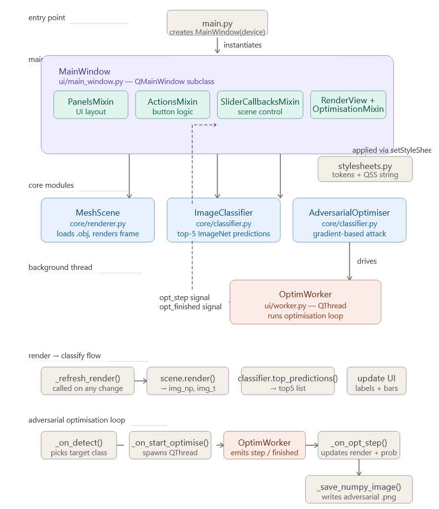

# Adversarial 3D Mesh Renderer

A desktop application that combines real-time 3D rendering with adversarial machine learning attacks. It loads a 3D model (e.g. a Jeep), renders it using a differentiable renderer, classifies the render with a neural network, and then automatically manipulates the scene — position, rotation, lighting — to trick the classifier into seeing something completely different.

---

## What It Does

Modern image classifiers (like those used in autonomous vehicles or security systems) can be fooled by subtle changes to an input image. This tool makes that process visual and interactive:

1. A 3D model is rendered into a 2D image using PyTorch3D
2. A pretrained ViT (Vision Transformer) classifies what it sees
3. You pick an adversarial target (what you want the model to wrongly believe it sees)
4. An optimiser iteratively adjusts the scene parameters (camera angle, object position, lighting) using gradient descent until the classifier is fooled
5. The "adversarial" image is saved to disk as proof

This is a research and educational tool for understanding adversarial robustness in computer vision.

---

## How It Works


### Core Components

**`core/renderer.py` — MeshScene**
Wraps a PyTorch3D differentiable renderer. Holds the scene parameters (`pos`, `rot`, `light_pos`, `ambient_intensity`) as PyTorch tensors with `requires_grad=True`. Has two render paths:
- `render()` — fast, no gradient tracking, used for UI display
- `render_differentiable()` — keeps the computation graph alive so gradients can flow back through the image into the scene parameters

**`core/classifier.py` — ImageClassifier + AdversarialOptimiser**
- `ImageClassifier` wraps a pretrained ViT-B/16 from `torchvision`. Takes a rendered image tensor and returns the top-5 ImageNet predictions.
- `AdversarialOptimiser` runs the attack loop: renders the scene differentiably, passes it through the classifier, computes a cross-entropy loss against the target class, and calls `loss.backward()` + `optimizer.step()` to nudge the scene parameters.

**`ui/main_window.py` — MainWindow**
The Qt6 main window assembled from five mixins:
- `PanelsMixin` — builds the three-column layout with sliders and controls
- `ActionsMixin` — handles button clicks (Detect, Save, Search class)
- `SliderCallbacksMixin` — translates slider movements into live scene updates
- `RenderViewMixin` — converts numpy image arrays into QPixmap and displays them
- `OptimisationMixin` — manages the background QThread that runs the attack loop

**`ui/worker.py` — OptimWorker**
A `QObject` that runs the optimiser in a background `QThread`, emitting a `step_done` signal after every iteration so the UI stays responsive during the attack.

---

## Project Structure

```
3d_project/
├── main.py                     # Entry point
├── config.py                   # Device, paths, render settings
├── core/
│   ├── renderer.py             # MeshScene — PyTorch3D wrapper
│   ├── classifier.py           # ImageClassifier + AdversarialOptimiser
│   ├── mesh_loader.py          # OBJ + MTL texture loading
│   └── background.py          # Background image loader
├── ui/
│   ├── main_window.py          # Main Qt window
│   ├── worker.py               # Background optimisation thread
│   ├── stylesheets.py          # Qt stylesheet tokens
│   ├── widgets/
│   │   └── slider_helper.py    # Float slider factory
│   └── mixins/
│       ├── panels.py           # UI layout builders
│       ├── actions.py          # Button handlers
│       ├── slider_callbacks.py # Slider → scene parameter bridge
│       ├── render_view.py      # Image display + prediction bars
│       └── optimisation.py     # Attack thread lifecycle
├── models/
│   └── Jeep/
│       ├── Jeep.obj
│       └── Jeep.mtl
└── background/
    └── background.png
```

---

## Installation

### Prerequisites

- Linux or Windows with a display
- NVIDIA GPU strongly recommended (CUDA 11.8 or 12.1)
- Conda (Miniconda or Anaconda)

### Step 1 — Create the conda environment

```bash
conda create -n pytorch3d_env python=3.10 -y
conda activate pytorch3d_env
```

### Step 2 — Install PyTorch with CUDA

For CUDA 11.8:
```bash
conda install pytorch=2.0.1 torchvision=0.15.2 torchaudio pytorch-cuda=11.8 \
    -c pytorch -c nvidia -y
```

For CUDA 12.1:
```bash
conda install pytorch=2.0.1 torchvision=0.15.2 torchaudio pytorch-cuda=12.1 \
    -c pytorch -c nvidia -y
```

For CPU only (slow, not recommended for the optimiser):
```bash
conda install pytorch=2.0.1 torchvision=0.15.2 torchaudio cpuonly -c pytorch -y
```

### Step 3 — Install PyTorch3D

PyTorch3D requires a pre-built wheel matched to your Python + PyTorch + CUDA versions.

```bash
# Install build dependencies first
conda install -c fvcore -c iopath -c conda-forge fvcore iopath -y
conda install -c bottler nvidiacub -y  # CUDA only

# Install PyTorch3D from the pre-built wheel
pip install "git+https://github.com/facebookresearch/pytorch3d.git@stable"
```

If that fails (common on some systems), use the pre-compiled wheel directly:
```bash
pip install pytorch3d -f https://dl.fbaipublicfiles.com/pytorch3d/packaging/wheels/py310_cu118_pyt201/download.html
```
Replace `cu118` and `pyt201` to match your CUDA and PyTorch versions.

### Important

- `numpy` must be **less than 1.27** (recommended: `numpy==1.26.4`)
- Using newer versions of NumPy may cause compatibility issues with PyTorch3D.

### Step 4 — Install remaining dependencies

```bash
pip install PyQt6 Pillow numpy
```

### Step 5 — Add your 3D model

Place your OBJ file and its MTL + texture files in the `models/` directory and update `config.py`:

```python
OBJ_PATH = "./models/YourModel/YourModel.obj"
```

Add a background image (any PNG/JPEG) to the `background/` folder and update:

```python
BACKGROUND_PATH = "./background/background.png"
```

### Step 6 — Run

```bash
conda activate pytorch3d_env
cd 3d_project
python main.py
```

---

## Configuration

All key settings live in `config.py`:

| Setting | Default | Description |
|---|---|---|
| `OBJ_PATH` | `./models/Jeep/Jeep.obj` | Path to the 3D model |
| `BACKGROUND_PATH` | `./background/background.png` | Background image |
| `IMAGE_SIZE` | `512` | Render resolution (pixels) |
| `CAMERA_DIST` | `8.0` | Camera distance from object |
| `CAMERA_ELEV` | `10.0` | Camera elevation angle |
| `CAMERA_AZIM` | `0.0` | Camera azimuth angle |
| `SUCCESS_THRESHOLD` | `0.80` | Confidence needed to declare attack success |
| `MODEL_NAME` | `vit_b_16` | Classifier backbone |

---

## Usage

1. **Launch** the app — the Jeep renders immediately with the classifier's top-5 predictions on the right
2. **Manual exploration** — drag the Position, Rotation, and Lighting sliders to see how the classifier reacts to different views
3. **Auto-detect** — click **Detect Object** to classify the current view and automatically pick an adversarial target (the model's second-best guess)
4. **Manual target** — type a class name (e.g. `warplane`, `cat`) in the Search box or use the spinner to pick any of the 1000 ImageNet classes
5. **Run the attack** — click **▶ Start Optimisation**. The renderer will iteratively adjust the scene to fool the classifier. Watch the Target prob bar climb.
6. **Save** — adversarial images are saved automatically on success, or use **Save Image** at any time

---

## Requirements Summary

```
python=3.10
pytorch=2.0.1
torchvision=0.15.2
pytorch3d (matched to above)
PyQt6
Pillow
numpy
```

---

## Notes

- The attack modifies scene parameters (position, rotation, lighting), not pixel values directly  making it a **physical adversarial attack** rather than a pixel-perturbation attack
- Render time per step is dominated by PyTorch3D's rasterizer; a GPU reduces this from ~2s to ~100ms per step
- The segmentation fault on startup is typically caused by a PyTorch3D/CUDA version mismatch. To solve the issue ensure your wheel matches your CUDA and PyTorch versions exactly


## Demo Video

[Watch the demo](./Demo.mp4)
